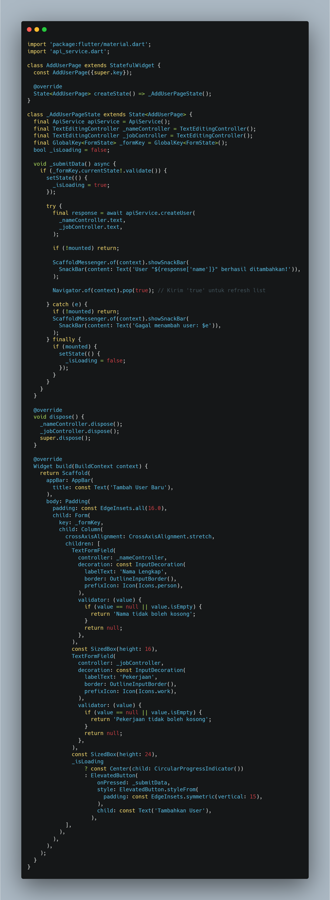
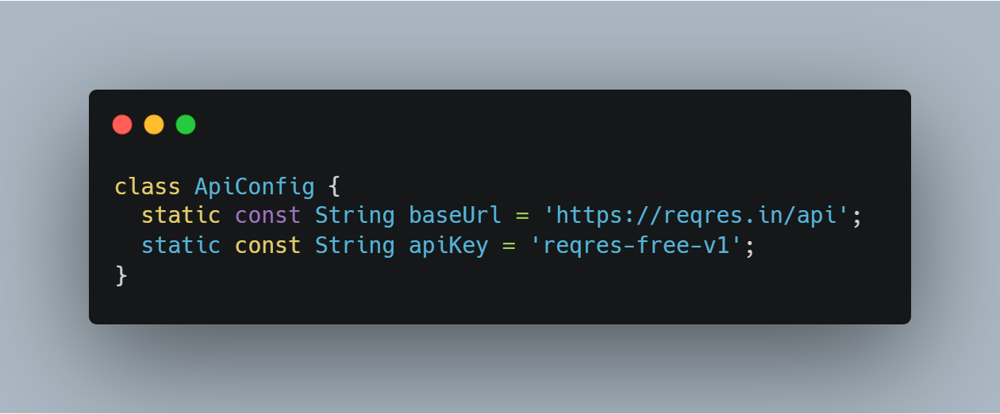
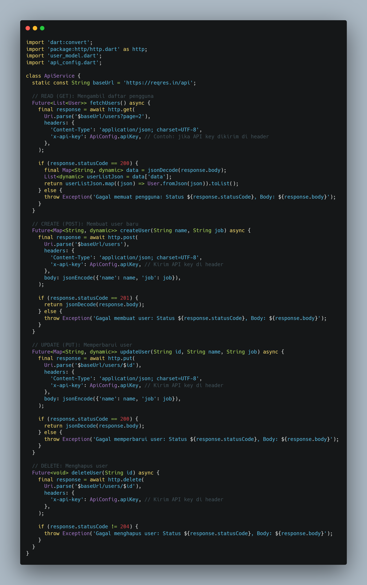
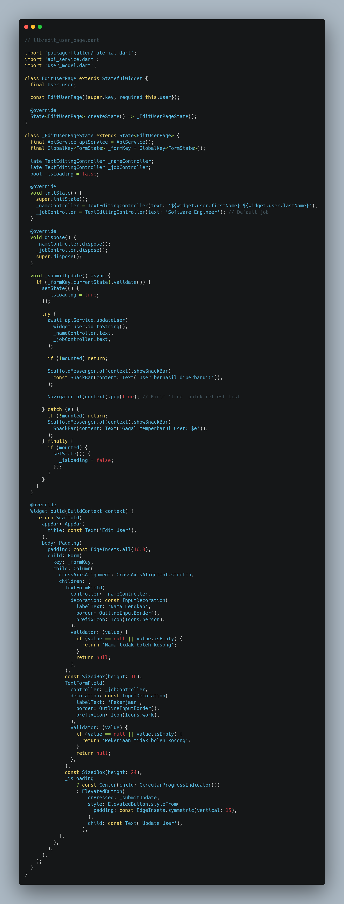
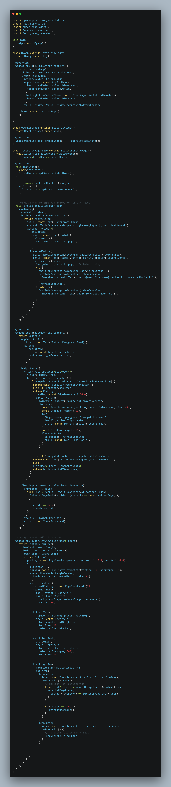
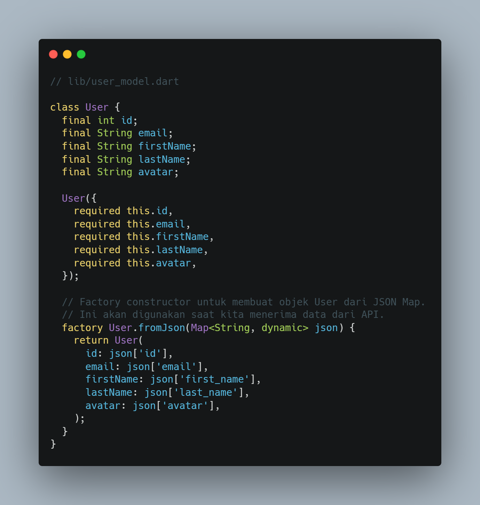
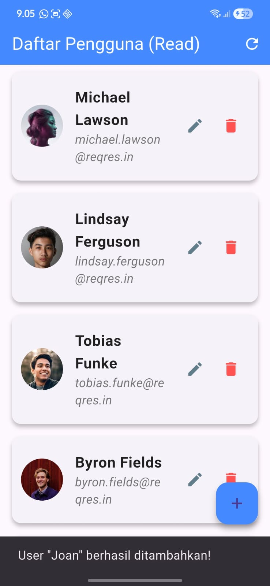

•(CRUD & STYLING)
•Pengenalan Implementasi Dasar API Eksternal
 
•	Tujuan Praktikum.
1.	Memahami konsep dasar API (Application Programming Interface) dan REST API.
2.	Menggunakan package http di Flutter untuk melakukan permintaan (request) ke API eksternal.
3.	Melakukan operasi CRUD (Create, Read, Update, Delete) terhadap data melalui API.
4.	Mengurai data JSON (parsing) dan mengubahnya menjadi objek Dart (Model).
5.	Menampilkan data dari API ke dalam UI Flutter menggunakan widget seperti ListView.
6.	Mengimplementasikan styling dasar pada komponen UI untuk menyajikan data den gan rapi.
7.	Mengelola state secara sederhana untuk menangani data yang bersifat asinkron (asynchronous).
•	Dasar Teori (penjelasan singkat tentang API, REST, JSON, http package).
1.	Apa itu API?
API (Application Programming Interface) adalah seperangkat definisi, protokol, dan tools untuk membangun perangkat lunak aplikasi. Dalam praktikum ini, API bertin dak sebagai jembatan yang memungkinkan aplikasi Flutter (klien) Anda berkomunikasi dengan server (backend) untuk mengambil atau mengirim data.
2.	REST API
REST (Representational State Transfer) adalah gaya arsitektur yang paling umum digunakan untuk membuat API berbasis web. REST API menggunakan metode HTTP standar untuk melakukan operasi pada resources.
3.	Package http 
Package http adalah library yang direkomendasikan untuk melakukan permintaan HTTP di Dart dan Flutter. Package ini menyediakan fungsi-fungsi mudah digunakan seperti http.get(), http.post(), http.put(), dan http.delete()

•Langkah-langkah implementasi (disertai screenshot hasil setiap bagian pent- ing).
Kode bagian add_user_page.dart
 
•Analisa :
Kode di atas berfungsi untuk menyediakan form input untuk nama lengkap dan pekerjaan user. Melakukan validasi agar beckend menggunakan metode createuser dari api_service.dart.

•Kode bagian Api_config.dart
 
Analisa :
Kode diatas berfungsi untuk memberikan akses ke api dikarenakan regres.in sekrang tidak bisa di akses kalau tidak menambahkan api key.

•Kode Bagian Api_service.dart
 
•Analisa :
Kode di atas berfungsi untuk mengirim pemintaan http Seperti POST,GET,PUT,DELETE ke server dan mengelola data yang d terima dari server dan mengembalikannya ke UI

•Kode bagian edit_user_page.dart
 
•Analisa :
Kode di atas berfungsi untuk menampilkan data user yang sudah ada ke dalam form(nama dan pekerjaan). Dan memungkinkan pengguna mengubah data mengirim datayang sudah di edit ke beckend menggunakan API 

•Kode bagian main.dart

•Analisa :
Kode di atas berfungsi untuk memanggl fungsi main menjalankan aplikasi menentukan widget utama mengatur routung tema dan halaman awal aplikasi

•Kode bagian User_model.dart

•Analisa :
Kode di atas berfungsi untuk deklarasi class user,Properti seperti id,name, dan job. Dan metod untuk konversi dari JSON ke objek dan sebaliknya (misal FromJson, toJson).
•HASIL :
•Membuat user :
 

•Mengubah data user :

•Kesimpulan dan Saran.
Jadi setelah menambahkan data baru data tersebut tidak akan tampil di bagian daftar pengguna di karenakan Data yang telah tambahkan lewat endpoint ini (misal POST untuk menambah user) tidak benar-benar disimpan secara permanen di server reqres.in.
Saya awalnya mengalami kesulitan dikarenakan perubahan persyaratan dari api yang telah di tentukan namun setelah saya mencari penyebabnya ternya reqres.in telah mengubah persyaratan yang awalnya tidak mengharuskan pengguna untuk memasukkan api key kemudian menjadi mengharuskan pengguna untuk memasukkan api key. Tetapi setelah error yang saya alami saya mendapatkan ilmu baru tentang API.

